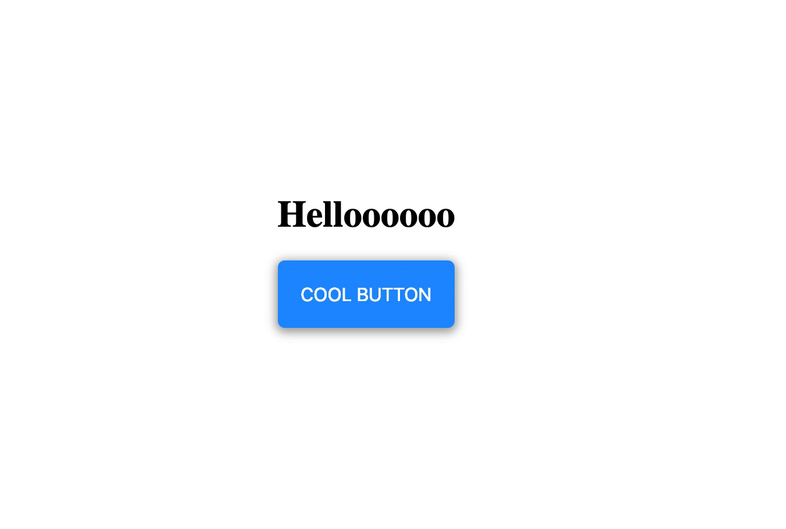

# 1.2 - CSS: Page Layout - Workshop

## Exercise 10

Create an `index.html` file and a `style.css` file that reproduces the following:



### Reference

- Use the `animation` property with 1s duration and _ease-in-out_ easing function
- Use `translate()` and `scale()` for the transform animations
- Use `cursor: pointer` on the button to change the cursor to a hand
- Use `text-transform` uppercase
- Check the `box-shadow` css property on google, w3schools has some examples on how it works

### Syntax needed

```
@keyframes
```

### Some helpful suggestions

```
transform
opacity
animation
padding
border
background-color
color
box-shadow
border-radius
font-size
cursor
text-transform
hover
```

## Bonus

- Make the button do a 360deg rotation when it bounces


- Use the syntax `transform:scale() rotate()` in your keyframe
