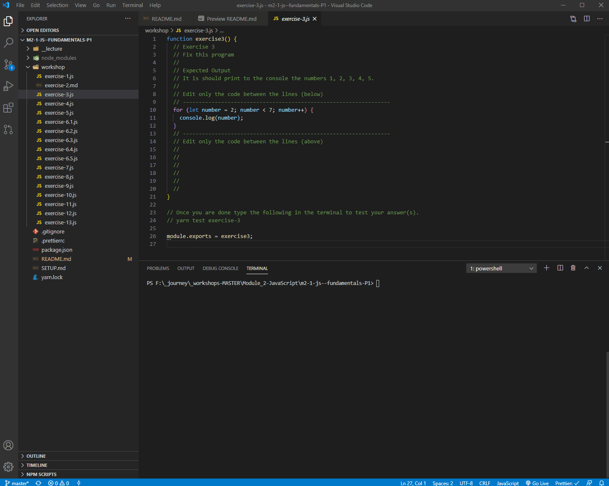

# JavaScript Fundamentals - Part 2

## 🦊 Pre-lecture

⏲️ _Estimated time required: 1 hour._

- Read the `.md` file in `0-pre-lecture`. It covers the initial fundamental concepts that we will be starting with during the lecture.
- Read this web page: [https://javascript.info/function-basics](https://javascript.info/function-basics). (Full understanding is not important. We are looking to create familiarity.)

---

## 🦉 Lecture

[lecture-1-methods-functions.pdf](1-lecture/lecture-1-methods-functions.pdf)

---

## Setup

Before starting the workshop, please run the following in the terminal. It will install all of the required dependencies. (More on that later.)

Type `ctrl`+ `j` to open the terminal inside of VS Code.

```bash
yarn install
```

## Running your code

> 💡 You can toggle the terminal window in VS Code with the following keyboard shortcut:
>
> - `[ctrl + j]` on Windows
> - `[cmd + j]` on Mac

This will open an instance of the terminal (Mac) or the PowerShell (Win).

## Type JS directly into the Node Env.

- Type the following in the terminal, and hit `enter`.

```bash
node __2-workshop/exercise-1.1.js
```

This will execute all of the code in the `exercise-1.1.js` file. _In this particular case, it will do the `console.log` (line 19) which calls the `countNames` function._

---

## Testing

This workshop can "test" your code and validate your answers. (We will talk more about this later.)

If you want to test your code/validate your answer, you can type `yarn test <FILE_NAME>` in the terminal (without the `.js`).



In this workshop, there will be a reminder to do this at the end of every exercise file.

---

## ⚡ Exercises

Each exercise file contains the question to answer, the puzzle to solve, what you need to achieve.

### Exercises 1 to 10

---

<center>🟡 - Minimally complete workshop (75%) - 🟡</center>

---

### Exercises 11 to 14

---

<center>🟢 - Complete workshop (100%) - 🟢</center>

---

### Exercises 15 to 20 (stretch)
