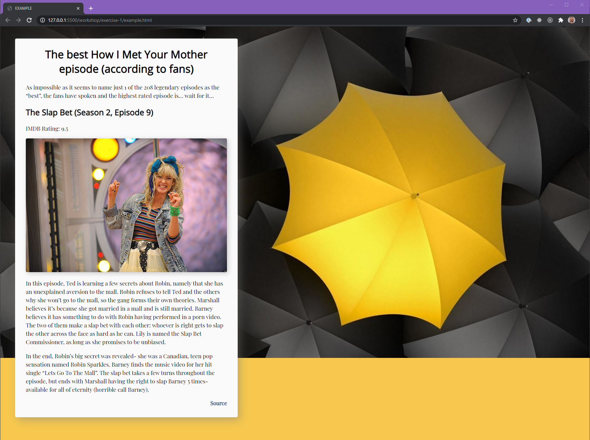

# JavaScript - The DOM - P1

---

## 🦊 Pre-lecture

⏲️ _Estimated time required: 45 minutes._

Read the first article and skim through the second one to begin to understand the power of the DOM and how it is used in JavaScript.

- Read the provided documents in the `__pre-lecture` folder.
- Read https://css-tricks.com/dom/ (article)
- Skim over this documentation: https://developer.mozilla.org/en-US/docs/Web/API/Document_Object_Model/Introduction

---

## 🦉 Lecture

[lecture-1-dom.pdf](__lecture/lecture-1-dom.pdf)

---

## Setup

```
yarn install
```

---

## Fundamentals

Starting today, there will be a fundamentals section in each workshop. These are optional but **_HIGHLY_** recommended!

They are a bit more challenging but will sharpen your JS skills!

---

## ⚡ Exercises

## Exercise 1 - Creating DOM Nodes



In this exercise, we'll see how to create web pages using Javascript alone!

In the exercise-1 folder, there are the following files.

- `example.html` (READ ONLY) This is the file that contains the HTML of a short webpage.
- `styles.css` (READ ONLY) Some styles that are used in `example.html`
- `exercise.html` (READ ONLY) This is the HTML file in which you will use JavaScript to recreate the HTML content from `example.html`
- `scripts.js` This is where you will write the JS required to inject all of the HTML into `exercise.html`
- `assets` Some images used in the example

Create the content of a webpage entirely with Javascript.

1. Recreate the content structure from `example.html`.
2. To do this, **you are not allowed to modify any of the HTML files**, only `scripts.js` should be modified.
3. Once you've completed this, compare `example.html` and your `exercise.html` file using "Live Preview", you will notice that they look nothing alike.
4. Add code to the `scripts.js` that will add a `<link>` to the `styles.css` in the `<head>` of `exercise.html`.

In other words: We'll start by recreating the HTML structure, without worrying about the styles. Once the HTML is correct, we'll add a `<link>` tag, which will add the relevant styles.

### How do I do this?

You'll need to make extensive use of `document.createElement`!

---

<center>🟢 - Complete workshop (100%) - 🟢</center>

---
