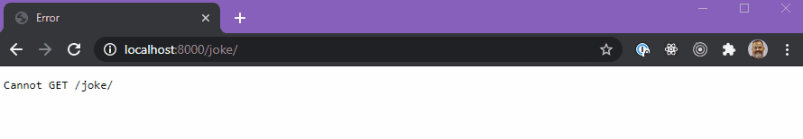

# Node.JS - Async / Await

## 🦊 Pre-lecture

⏲️ _Estimated time required: 30 minutes._

...nothing yet...

---

## 🦉 Lecture

- [lecture-0-review.md](__lecture/lecture-0-review.md)
- [lecture-1-async-await.md](__lecturelecture-1-async-await.md)

Keep in mind that these slides are not interactive, like in the actual lecture. Whenever possible, we will provide links to working code examples in CodeSandbox.

---

## Setup

- `yarn install`

You will not need to spin up a server in this workshop. You can "run" the files individually in the terminal by doing `node <PATH_TO_FILE>` for most of the exercises.

### Exercise 0

In the example from last workshop we had a Promise that compared a number to the number 10.

```js
// The Promise
const compareToTen = (num) => {
  return new Promise((resolve, reject) => {
    num > 10
      ? resolve(num + " is greater than 10, success!")
      : reject(num + " is less than 10, error!");
  });
};

// Calling the Promise
compareToTen(15)
  .then((result) => console.log(result))
  .catch((error) => console.log(error));
```

If we convert the Promise **call**, to an `async` function that includes a `try`/`catch` (for better error handling), we end up with something like this:

```js
const handleCompareToTen = async (num) => {
  try {
    const result = await compareToTen(num);
    console.log(result);
  } catch {
    console.log(err);
  }
};

// Calling the function (that uses the Promise)
handleCompareToTen(15);
handleCompareToTen(8);
```

Using `async`/`await` in this case requires a little more setup as we create a function that uses the Promise, but calling the code becomes much simpler as there is no need to chain a bunch of `then`s everytime we want to use the Promise.

## Exercise 1

Rewrite the text transformation exercise from the last workshop to use `async`/`await`.

## Exercise 2 - `getIssPosition`

Async/Await becomes much more useful when dealing with APIs, and modules that wrap Promises.

Fill in the blanks of a rewritten version of the `getIssPosition` code from last workshop.

## Exercise 3

1. Write a function called `doublesLater` that returns a new Promise that doubles a number after 2 seconds.
2. Here is a promise called `handleSum` uses the `doublesLater` Promise. It takes a `num`, doubles it 3 times (with the `doublesLater` Promise), and returns the sum of the three successive doubles. As you can see, it is quite the hellish situation. _it is also a convoluted and totally fabricated situation..._

```js
const handleSum = (num) => {
  let theSum = 0;
  return new Promise((resolve) => {
    doublesLater(num).then((a) => {
      theSum += a;
      doublesLater(a).then((b) => {
        theSum += b;
        doublesLater(b).then((c) => {
          theSum += c;
          resolve(theSum);
        });
      });
    });
  });
};
```

3. Rewrite `handleSum` with `async`/`await`.

---

## Exercise 4 - Just Jokes!


### Exercise 4.1 - `getDadJoke`

1. Head over to https://icanhazdadjoke.com/api. Read the documentation...
2. Write a Promise that called `getDadJoke` that will return a random joke from this API. _Return only the actual joke as a string._
3. The `request-promise` module accepts a `uri` but can also accept an object with various parameters. _You will want to set the headers to `"Accept": "application/json"`_
4. `console.log` the result to read the joke.

READ the [request-promise NPM page](https://www.npmjs.com/package/request-promise#get-something-from-a-json-rest-api) for more information.

### Exercise 4.2 - `getPun`

1. Head over to https://v2.jokeapi.dev/. Read the documentation...
2. Write a Promise that will return a random joke.

- Set category to `Pun`.
- Blacklist all the flags to avoid inappropriate content.
- Make sure the response is in `json` format.
- You can choose `single` or `two` part jokes; just make sure the full joke is returned by your promise!

### Exercise 4.3 - `getGeekJoke`

1. Head over to https://v2.jokeapi.dev/. Read the documentation...
2. Write a Promise that will return a random joke.

- Set category to `Programming`.
- Blacklist all the flags to avoid inappropriate content.
- Make sure the response is in `json` format.
- You can choose `single` or `two` part jokes; just make sure the full joke is returned by your promise!

---

<center>🟡 - Minimally complete workshop (75%) - 🟡</center>
  
---

## Exercise 5 - A Backend Joke Service

We are going to create a server that will respond with a joke based on the endpoint that the user calls.

1. Export the joke functions you wrote in Exercise 4.
   - Go back to each function in exercise 4 and add in a line at the bottom of the file that `exports` the function.

```js
module.exports = { myFunction };
```

2. In `server.js` create the following endpoint:

```html
/joke/:type
```

3. `Require` all of the joke functions in the provided `handlers.js` file.
4. This file should also contain a function called `handleJoke` that returns a joke of the type requested (`dad`, `tronald` or `geek`).
5. Don't forget to do `yarn dev` to run the server.

## 

<center>🟢 - Complete workshop (100%) - 🟢</center>

---

## Exercise 6 - The Frontend

Add a React Frontend to render the jokes to the browser.
