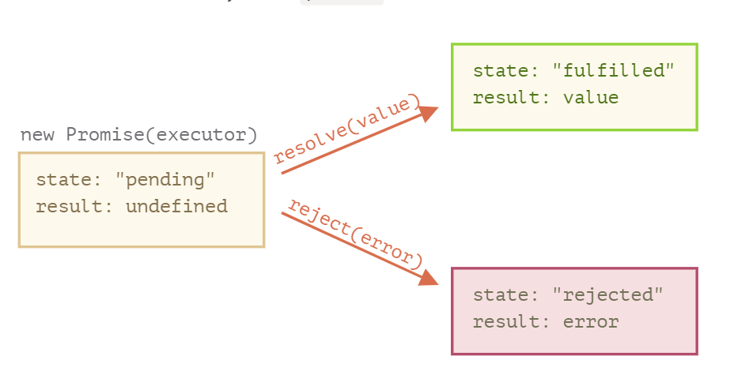

---

marp: true

---

# Review Promises

---

```js
const pauseFunction = () => {
  return new Promise((resolve, reject) => {
    console.log("entering the promise(d) land");
    resolve("resolve");
    console.log("...in limbo...");
    reject("reject");
    console.log("shuffling off...");
  });
};
```

---

Let's make it pause now...

```js
const pauseFunction = () => {
  return new Promise((resolve, reject) => {
    console.log("entering the promise(d) land");
    resolve("resolve");
    console.log("...in limbo...");
    reject("reject");
    console.log("shuffling off...");
  });
};
```

---


