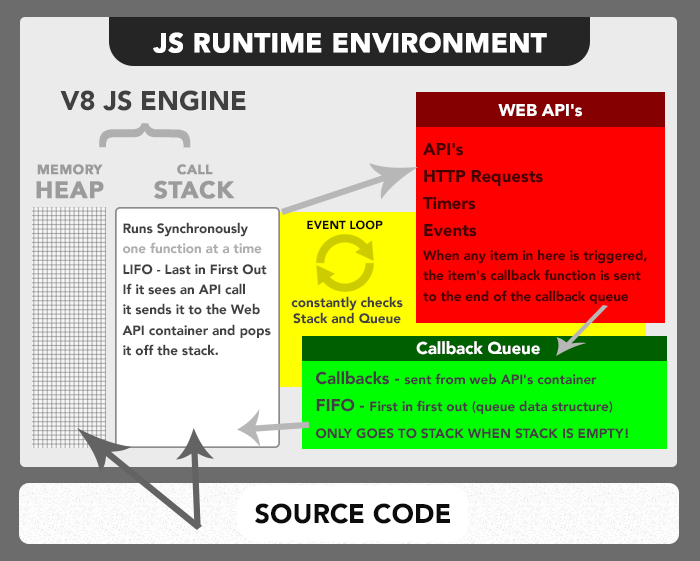

# Node.Js


---

### A Little History

- Created by Ryan Dahl, to use JavaScript on the backend
- Initially ridiculed, now widely used by companies like Netflix, PayPal etc
- Integrated really well with a database called MongoDB

---

### What is Node?

- It's a Javascript run-time environment for executing JavaScript code outside a browser => **server-side**.
- Often used to build Backend services (APIs) that power our client apps like an Web/Mobile App
- It is chrome's v8 engine embedded into C/C++ code
- It's similar to the JS environment in the browser, but without the DOM (so no `window` or `document` objects anymore) and other [Web APIs](https://developer.mozilla.org/en-US/docs/Web/API)

---

Node has access to set of services offered by underlying OS (built in utilities)

- Interacting with the file system
- Sending emails and text messages
- Be an HTTP server (like LiveServer)
- Accessing a database
- [Node JS API](https://nodejs.org/docs/latest/api/)

---

## Using the file-system module to read a file

```
const fs = require("fs");
const { readFileSync } = fs;

const data = readFileSync("data.txt", "utf8");
console.log(data);

```

---

We'll be using it as a _backend server_.

What are some other languages/frameworks that could be used instead of Node?

---

### Why Node?

---


---

#### More advantages

- Ability to write a **complete/full-stack** application in one language (JS)
- The Wealth of _modules_ available to us in development

---

### The Node Ecosystem


---

### Chrome's JS runtime environment

import js_rt from './assets/browser_js_runtime.png';



---

#### Modules? What are modules?

_...before we talk about that, an example._

---

#### Example

It's possible to cook everything from scratch without needing another human being... It involves

- build farm equipment
- grow crops
- self-manufacture cooking equipment
- etc.

---

_Clearly it's best to use things that are already available, that already exist._

---

Enter `node_modules` and [NPM](https://www.npmjs.com/https://www.npmjs.com/) (Node Package Manager)

- npm is a tool that lets you download code written by others.

This can save you a substantial amount of time. You don't _always_ have to reinvent the wheel.

---

#### Example

You want your friend to cook a specific meal. So you send him the recipe.

---

##### What about the ingredients? You can either

- ship him/her all of the ingredients
- give him a list of ingredients and leave it to him/her to get them himself.

---

All Node projects include a `package.json`.

_The package.json is the ingredient list, and the code is the recipe._

---

### package.json

-- could be good place to show , creating a node project from scratch

This file is created by `npm`. There is _one_ file per project.

It contains all the names of all the modules needed for the project.

---

```json
{
  "name": "node-wksp-1",
  "version": "0.5.0",
  "description": "This is our first Node Workshop!",
  "main": "server.js",
  "scripts": {
    "start": "node server.js",
    "dev": "nodemon server.js"
  },
  "author": "Scott Morin <scott@journeyedu.co>",
  "license": "MIT",
  "dependencies": {
    "express": "^4.17.1",
    "moment": "^2.24.0",
    "morgan": "^1.9.1",
    "nodemon": "^2.0.2"
  }
}
```

---

### But what is a module?

A module, or library, is a set of files, usually written by someone else.

- These reside inside of the `node_modules` folder.
- You can import node modules the `yarn` command.

```bash
// example (this will add the 'express' module)
yarn add express
```

In this course, we will be using `yarn` to install npm packages. `yarn` commands are a little simpler, but we could have also chosen `npm`.

Node Package Manager or simply npm is Node's centralized package manager

---

This will add a module to the `node_modules` folder as well as update the `package.json` file.

---

To install all of a project's dependencies, you type `yarn install`.

All of the dependencies listed in the `package.json` will be installed.

---

### Importing

To use a module, you import it with `require`:

```js
const multiply = require("multiply");

multiply(3, 6);
```
