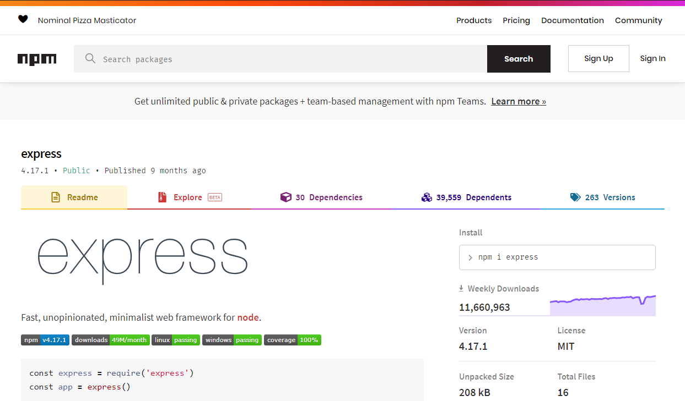

## The Client-Server Architecture


---

# [Express](https://www.npmjs.com/package/express)



---

## One of the most important node modules

It removes _a lot_ of the complexity around creating and maintaining a server.

---

### Example

This will give us a barebones server that we can _GET_ content.

```js
// The Express module exports a function
const express = require("express");

// Creates an Express apllication
const app = express();

app.get("/", (req, res) => {
  res.status(200).json({status: 200, message: "Hello"})
});

// tells where to listen to for incoming requests
app.listen(4000);
```

---

## HTTP request methods

- HTTP defines a set of request methods
- GET is one such method
- It is used to request a resource "representation"
- Requests using GET should only retrieve data

---

When you type a url in the browser, or click a link on a webpage, you are making...

**...a GET request to a server somewhere. You are _requesting_ content.**

---

```js
app.get('/', (req, res) => {
  res.status(200).json({status: 200, message: "Hello"})
});
```

- 2 parameters, the endpoint and a cb which gets called
- The cb takes in 2 non-optional parameters itself, which represent
- The request object (req): has information about the request
- The response object (res): which allows us to send a response back
