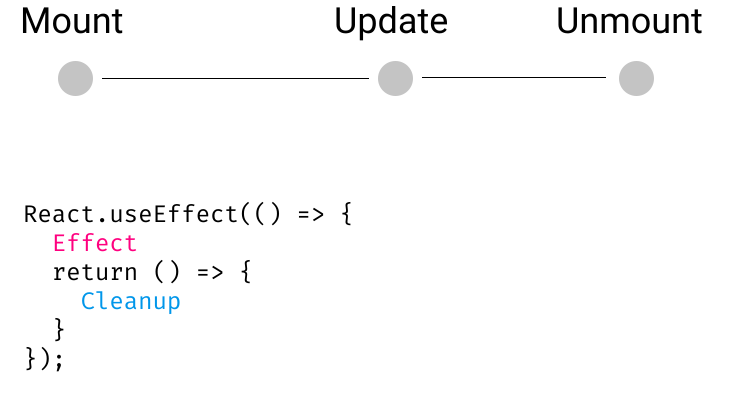

# UseEffect hook

---

## Side effects

What happens when you want to do something _other_ than rendering to the screen?

---

- Updating the document title
- Fetching data from a network
- Doing something when the user scrolls

---

## Doing something on scroll

Here's how we do this in vanilla JS:

```js
window.addEventListener("scroll", () => {
  console.log("User scrolled!");
});
```

---

What about in React?

---

# 🙅‍♀️Not the answer:

```js
const App = () => {
  window.addEventListener("scroll", () => {
    console.log("scroll");
  });

  return (
    <div style={{ height: "500vh" }}>
      <p>This is bad.</p>
      <p>Set some state in the event listener to see why.</p>
    </div>
  );
};
```

---

# The `useEffect` hook

---

```js
// `useEffect` takes a function.
// It calls this function AFTER the render
useEffect(() => {});
```

It calls this function **AFTER** the render

---

It takes a "dependencies" array

```js
useEffect(() => {
  console.log("some state changed!");
}, [someState, someOtherState]);
```

---

Neat example: logging

```js live=true
const Input = ({ val, handleChange }) => {
  React.useEffect(() => {
    console.log(val);
  }, [val]); // <-- here

  return (
    <input
      value={val}
      onChange={(ev) => handleChange(ev.target.value)}
    />
  );
};

const App = ({ title }) => {
  const [name, setName] = React.useState("");
  const [address, setAddress] = React.useState("");

  return (
    <>
      <Input val={name} handleChange={setName} />
      <Input val={address} handleChange={setAddress} />
    </>
  );
};

render(<App />);
```

---

## Fetching from a network

You _definitely_ don't want to do this in every render

---

```js
const App = () => {
  const [cart, setCart] = useState({});

  // Bad
  fetch("some-url").then((data) => {
    console.log("Got data:", data);
    setCart(data);
  });
  
  // Good
  useEffect(() => {
    fetch("some-url").then((data) => {
      console.log("Got data:", data);
      setCart(data);
    });
  }, []);

  // ...
};
```

---

**Tip:** Use an empty dependency array to _only_ run the fetch on mount

---

# Exercises

Update the following snippets to make use of `useEffect`

---

```js
const App = () => {
  const [count, setCount] = useState(0);

  document.title = `You have clicked ${count} times`;

  return <button onClick={() => setCount(count + 1)}>Increment</button>;
};
```

---

```js
const App = ({ color }) => {
  const [value, setValue] = useState(false);

  window.localStorage.setItem("value", value);
  window.localStorage.setItem("color", color);

  return (
    <div>
      Value: {value}
      <button onClick={() => setValue(!value)}>Toggle thing</button>
    </div>
  );
};
```

---

```js
const Modal = ({ handleClose }) => {
  window.addEventListener("keydown", (ev) => {
    if (ev.code === "Escape") {
      handleClose();
    }
  });

  return <div>Modal stuff</div>;
};
```

---

# Unsubscribing

---

There's one other thing to know about `useEffect`: you can _clean stuff up_ when values change.

---

### The problem:

Let's say we have some routes:

```js
<Router>
  <Route exact path="/">
    <Home>
  </Route>
  <Route path="/about">
    <About />
  </Route>
</Router>
```

---

Our Home component has some sort of event listener.
It also has a link to the other route.

```js
const Home = () => {
  useEffect(() => {
    window.addEventListener("scroll", func());
  }, []);

  return (
    <div>
      <Link to="/about">About</Link>
    </div>
  );
};
```

---

We click the "About" link.

The scroll handler _doesn't go away_ just because we changed components.

`<Home>` is no longer rendered, but its scroll-handler lives on.

---

# Unsubscribing

```js
const Home = () => {
  useEffect(() => {
    window.addEventListener("scroll", aFunc);

    return () => {
      window.removeEventListener("scroll", aFunc);
    };
  }, []);
};
```

---

Unsubscribes are processed **right before** the next update, and **right before** removal.

---



---


---


---


---

# Exercises

Make sure to do the appropriate cleanup work

---

```js
// seTimeout is similar to setInterval...
const App = () => {
  useEffect(() => {
    window.setTimeout(() => {
      console.log("1 second after update!");
    });
  }, []);
};
```

---

```js
const App = () => {
  useEffect(() => {
    window.addEventListener("keydown", (ev) => {
      console.log("You pressed: " + ev.code);
    });
  }, []);
};
```