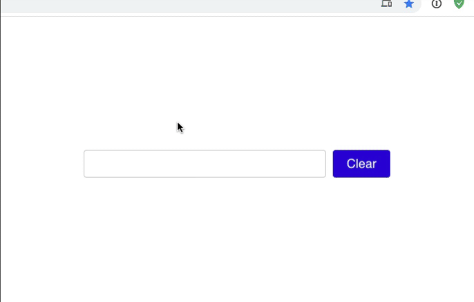

# Typeahead

## 🦊 Pre-lecture

⏲️ _Estimated time required: 30 minutes._

- Take this time to go ack and complete the hangman game to 100% (including the stretch goals).

---

## 🦉 Lecture

There is no new content today. We will build a toggle component together, in class!

- Starter code: https://codesandbox.io/s/toggle-activity-oyg83

---

## ⚡ Exercises

This workshop challenges you to build a common reusable component: The **Typeahead**.

Also called an **Autocomplete**, this component is designed to give users suggestions as they type, and allow the user to pick between the presented options.

Here's a finished working demo:

## Exercise 1: Initial Structure

Open this exercise file: [exercise-1.md](__workshop/exercise-1.md)

## Exercise 2: Showing and Picking Suggestions

Open this exercise file: [exercise-2.md](__workshop/exercise-2.md)

## Exercise 3: Conditional Rendering

Open this exercise file: [exercise-3.md](__workshop/exercise-3.md)

## Exercise 4: Formatting the Matches

Open this exercise file: [exercise-4.md](__workshop/exercise-4.md)

---

🟡 - Minimally complete workshop (75%) - 🟡

---

## Exercise 5: Keyboard Navigation

Open this exercise file: [exercise-5.md](__workshop/exercise-5.md)

---

🟢 - Complete workshop (100%) - 🟢

---

## Exercise 6: Wrapping up Keyboard Support (stretch)

Open this exercise file: [exercise-6.md](__workshop/exercise-6.md)

## Exercise 7: Screen Readers (stretch)

Open this exercise file: [exercise-7.md](__workshop/exercise-7.md)

## Exercise 8: Grouping by Category

Open this exercise file: [exercise-8.md](__workshop/exercise-8.md)
