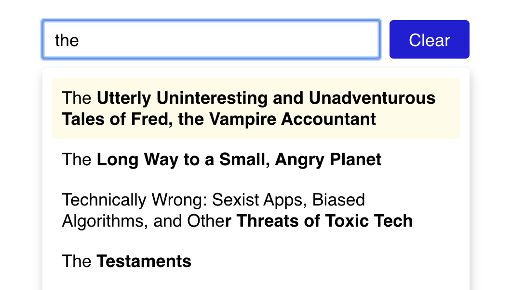

# Exercise 4: Formatting the Matches

Amazon and other websites make it easy to find where your search term is within the suggestion. For example, see how Amazon bolds the rest of their suggestion?


Let's do the same thing. We'll need to split the matched suggestion's title into 2 pieces, to do something like this:

```jsx
// Given a search term "Dea", and the suggestion "Dear girls":
<span>
  Dea
  <Prediction>r girls</Prediction>
</span>;

// And then, further down:
const Prediction = styled.span`
  font-weight: bold;
`;
```

> **Why not use a `<strong>` tag?**
>
> The `strong` HTML element is meant to imply that a specific word in a sentence is very important and should be stressed. In this case, the bold lettering is purely a cosmetic effect, to make it easier to scan. The correct approach is to use a `span`, which doesn't communicate anything to search engines and screen-reader users.

In your app, both of these will be variables:

```jsx
<span>
  {firstHalf}
  <Prediction>{secondHalf}</Prediction>
</span>
```

Your goal will be to find the index of that cross-over point (in this example, it's `3`, since the first half includes indices 0 through 2).

We should see the "prediction" part of the string bolded:



> HINT: there are a number of ways to solve this, but you can use `indexOf` and `slice` to create the two string segments

Finally, we also want to show the associated categories with each item:


We have all of the category data in our `data.js` file, imported in `App.js`. Pass the full set of categories as a prop to `Typeahead`.

While mapping through each `matchedSuggestion`, use the suggestion's `categoryId` to look up the relevant category object, and render its title, using purple italics.
